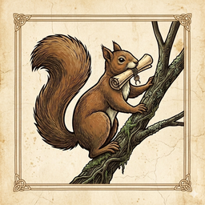
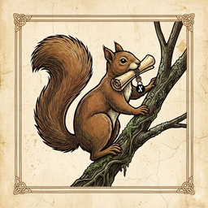
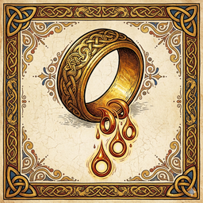
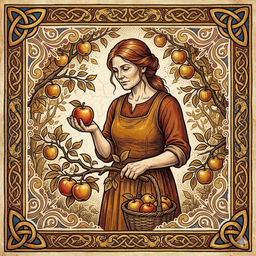
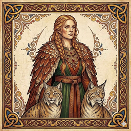

# EFD Brand Kit

Official public brand assets for **Enchanted Forest DeFi (EFD)** and its products: **RATR** (Ratatoskr — native PoW + masternode chain), **wRATR** (wrapped RATR on Alephium), and the broader EFD house brand.

Licensed under **[Creative Commons Attribution 4.0 International (CC-BY 4.0)](LICENSE)**.

---

## The marks

| | RATR (native) | wRATR (Alephium-wrapped) |
|---|---|---|
| Preview |  |  |
| File | [`logos/ratr/ratr-mark-256.png`](logos/ratr/) | [`logos/wratr/wratr-mark-256.png`](logos/wratr/) |
| Style | Illuminated-manuscript red squirrel on mossy branch with parchment scroll + horseshoe seal, Celtic trefoil corners on aged parchment | Same base, with the [Alephium round logo](logos/side-coins/alephium/) added as a second seal hanging from the scroll cord — the double seal IS the wrap |
| Use | Listings, native-chain communications, miner-facing material, RATR comms | Alephium DeFi contexts (Elexium, alephium/token-list submissions, wRATR LP pairs) |

**Token-list logoURI for wRATR:**
```
https://raw.githubusercontent.com/EnchantedForestDeFi/efd-brand-kit/main/logos/wratr/wratr-mark-256.png
```

---

## The pantheon (treasury trio)

EFD's brand uses a Norse-mythology character roster. The first three characters — the **treasury trio** — are shipped together. More characters are queued for phased rollout (Norns triptych, Hel, Skadi).

| Draupnir | Idunn | Freyja |
|:---:|:---:|:---:|
|  |  |  |
| **The mechanism** | **The steward** | **The deployer** |
| Odin's ring that drips eight identical rings every nine nights — mapped to RATR's automatic 10% block-subsidy treasury drip (consensus-encoded, no human decision) | Norse Vanir goddess tending the orchard of immortality apples — mapped to the role of tending accumulated treasury holdings (decides what to harvest, what to ripen) | Norse Vanir goddess of wealth, seiðr, war, and love — mapped to the role of putting wealth into motion (LP, gauge votes, bribes, ve(3,3) locks) |

> Together they tell the whole treasury story: **what comes in, what is kept, what is sent out to work.**

See [`characters/`](characters/) for full sheets + all sizes + the queue for Phase 2-3 additions.

---

## What's in this repo

| Subtree | Contents |
|---|---|
| [`logos/ratr/`](logos/ratr/) | Native Ratatoskr (RATR mainnet) marketing mark + wallet icon family + network color variants |
| [`logos/wratr/`](logos/wratr/) | Wrapped RATR (Alephium-side) mark — used in alephium/token-list submissions |
| [`logos/efd/`](logos/efd/) | EFD house brand mark + wordmark |
| [`logos/side-coins/`](logos/side-coins/) | Reference logos for cross-chain contexts (Alephium mirror, KRGN, NUTTY, etc.) |
| [`heroes/`](heroes/) | Hero-scale images for press kits, BitcoinTalk headers, social media, website hero positions |
| [`wordmarks/`](wordmarks/) | Text-only marks (no symbol) |
| [`palette/`](palette/) | Locked HEX color palette |
| [`typography/`](typography/) | Font specs (Cinzel + Inter + JetBrains Mono) |
| [`characters/`](characters/) | Pantheon character artwork (Draupnir, Idunn, Heimdall, Tomte, Forseti, Vár, Freyja, the Norns, Hel, Skadi, etc.) |
| [`docs/`](docs/) | Brand direction + icon brief + yggdrasil/lore reference + token-list PR materials |
| [`source/`](source/) | Master raster sources for re-rendering / variant production |

---

## Quick use

**Need a logo right now?**

- For most uses, grab `logos/ratr/ratr-mark-256.png` (raster) or `logos/ratr/ratr-mark.svg` (vector)
- For wRATR contexts, use `logos/wratr/wratr-mark-256.png` instead
- For dark backgrounds, use the `dark-variants/` subfolder in each logo directory
- For Alephium token-list PRs, the canonical URL is:
  `https://raw.githubusercontent.com/EnchantedForestDeFi/efd-brand-kit/main/logos/wratr/wratr-mark-256.png`

**Need the brand color palette?** See [`palette/brand-colors.md`](palette/brand-colors.md).

**Need fonts?** See [`typography/fonts.md`](typography/fonts.md).

---

## License (CC-BY 4.0)

You may freely:

- **Share** — copy and redistribute the material in any medium or format
- **Adapt** — remix, transform, and build upon the material
- **Commercial use** — including in commercial products

Under the following terms:

- **Attribution** — You must give appropriate credit (link back to this repo or to https://enchantedforestdefi.com), provide a link to the license, and indicate if changes were made.

See [`LICENSE`](LICENSE) for full text.

---

## Contributing

Found a typo, missing size, or want to add a variant? See [`CONTRIBUTING.md`](CONTRIBUTING.md).

Want to use a logo and have a question about attribution or co-branding? Open an issue or email `releases@enchantedforestdefi.com`.

---

## Authoritative project links

- **Website:** https://enchantedforestdefi.com
- **Ratatoskr (RATR):** Mainnet launches 2026-06-01 00:00 UTC
- **Block explorer:** https://ratrexplorer.enchantedforestdefi.com
- **Mining pool (EU):** https://pool.enchantedforestdefi.com
- **Discord:** Link added at launch
- **BitcoinTalk thread:** Link added at launch

---

*This repository is the canonical home for all EFD public brand assets. If you found a logo on another site that doesn't appear here, it may be outdated. Always pull from this repo for current versions.*
