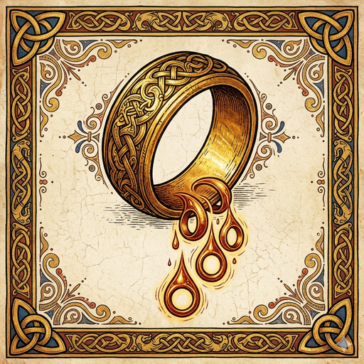
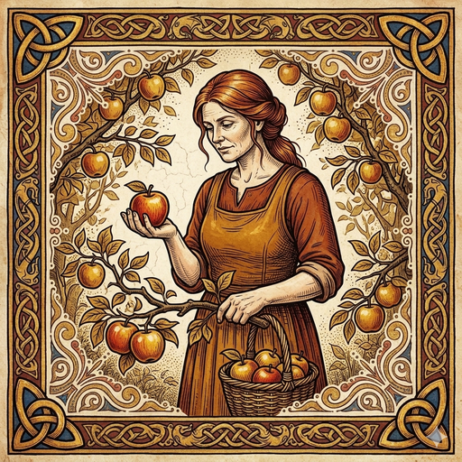

# EFD Pantheon Character Artwork

Canonical character portraits for the EFD / Norse-mythology character roster.

The EFD pantheon draws on Norse mythology and Scandinavian folklore. Characters appear in: lore page, Discord bot personas, future 3D Realm (Godot-based walkthrough), press / brand contexts.

---

## Released characters (phased rollout)

| Character | Domain | Status | Folder |
|---|---|---|---|
| **Draupnir** | Treasury drip mechanism (object / ring — drips 8 identical rings every 9 nights, mapped to RATR's 10% block-subsidy treasury drip) | ✅ **ART SHIPPED** | [`draupnir/`](draupnir/) |
| **Idunn** | Treasury holdings steward (Vanaheim orchard — tends what Draupnir drips) | ✅ **ART SHIPPED** | [`idunn/`](idunn/) |
| **Freyja** | LP / DeFi / dynamic-wealth patron (Vanaheim, Fólkvangr) | Placeholder | `freyja/` |
| **The Norns** | Chain history / consensus state (Yggdrasil's root well) | Phase 2 | `norns/` (triptych + individuals) |
| **Hel** | Slashed-MN / consequence-keeper (Helheim) | Phase 2 | `hel/` |
| **Skadi** | Cold storage / air-gap (Niflheim mountains) | Phase 3 | `skadi/` |

---

## Draupnir (the first character shipped)

**Style:** Illuminated-manuscript / engraved-woodcut. A substantial gold ring with intricate Norse knotwork engraving on the band; from the ring's interior, smaller golden droplet-rings are forming and dripping as the magical duplication occurs. Aged parchment background with subtle craquelure texture; ornate Celtic knotwork frame with trefoil corners and braided side panels in gold and deep blue accents.

**EFD meaning:** Draupnir is the treasury's *mechanism*, not its steward. The mythological ring drips 8 identical rings every 9 nights without human decision — exactly how RATR's 10% block-subsidy treasury allocation works (consensus-encoded, no per-block discretionary vote, just continuous accumulation). Draupnir appears in EFD's lore wherever the treasury drip itself is being referenced; Idunn (the *steward*) appears wherever the treasury's accumulated holdings are being tended.

---

## Idunn (treasury holdings steward)

**Style:** Same illuminated-manuscript / engraved-woodcut family as Draupnir — matched Celtic frame with trefoil corners + braided side panels in gold and deep-blue accents. A mature woman with red-brown hair tied back, wearing a russet-and-amber Vanir working dress with sleeves rolled to the elbows. She holds a single red-gold apple cupped in her palm at chest height, looking down at it with quiet care. Behind her, an orchard of apple-laden branches; at her feet, a wicker basket half-full of harvested fruit. Aged parchment background with craquelure.

**EFD meaning:** Where Draupnir is the *mechanism* (consensus-encoded automatic drip), Idunn is the *steward* (the role of tending the accumulated treasury). She is generational — the steady hand who has tended the orchard through many seasons, knows which apples to harvest now and which to leave to ripen, and does not rush. In EFD lore, Idunn appears wherever the treasury's accumulated holdings are being discussed: governance proposals to spend reserves, long-term Elexium LP positions, gauge-vote allocations, monthly treasury reports. She is the human (or governance-collective) face of decisions Draupnir cannot make on his own.

The Idunn–Draupnir pair is the full treasury narrative: **the mechanism cannot choose; the steward chooses what is harvested.**

---

## Already-established characters (legacy)

These characters exist in EFD's lore + brand work but their artwork currently lives in scattered places (in-repo wallet brand assets, memory docs, Discord bot config). Migration into this subtree is planned.

| Character | Domain | Current location |
|---|---|---|
| **Heimdall** | Bridge sentinel (Bifröst) | Internal lore docs + Discord bot |
| **Tomte** | Domestic tinkerer / miner-onboarding | Internal lore docs + Discord bot |
| **Forseti** | Judge / dispute mediator (Glitnir) | Internal lore docs + Discord bot |
| **Vár** | Oath-keeper (Eiðsalr) | Internal lore docs |

---

## Pantheon design principles

1. **Mythological grounding** — every character has documented canonical sources (Prose Edda, Poetic Edda, folkloric sources). Invented hall names or attributes are flagged transparently.
2. **No two characters share a dominant color palette** — visual differentiation is intentional.
3. **Cultural respect** — Norse mythology is treated with care; we decline to claim authority on Norse religion and credit sources where applicable.
4. **Counter-default aesthetics** — character art deliberately avoids Marvel / Skyrim / Disney defaults. Each character has explicit anti-references in their visual spec.

---

## Future additions (reserve)

The pantheon may expand over time. Reserve candidates: **Saga** (chronicler), **Eir** (healer), **Frigg** (oracle / wisdom), **Sif** (harvest), plus folklore-layer figures (**Vörd**, **Dís**).

---

## License + attribution

All character artwork created by EFD or commissioned for EFD is **CC-BY 4.0** (per repo `LICENSE`). Attribution required if used externally.

Mythological reference material (Eddas, sagas) is in the public domain. Specific artistic rendering, character design choices, color signatures, and EFD-specific narrative are CC-BY 4.0.
